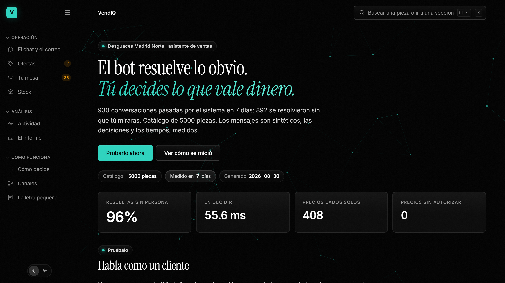

# VendIQ — asistente de ventas para un desguace (local, coste 0)

[](https://github.com/aulazaro28110-prog/VendIQ/actions/workflows/pruebas.yml)
[](LICENSE)



*El centro de control, con los datos de una tirada real de siete días. Todo lo que se ve
sale de ejecutar el buscador y el motor de ofertas: no hay ni una cifra escrita a mano.*

**VendIQ** contesta a los clientes de un desguace (Desguaces Madrid Norte) por WhatsApp
**fundándose en los datos reales de la empresa** y no en lo que "cree saber". Se ejecuta
entero en local y sin API de pago.

Qué hay montado hoy: catálogo de **5.000 piezas**, búsqueda híbrida con guardarraíles,
redactor con la voz real de la empresa, simulador de WhatsApp en un centro de control web,
motor de ofertas, y un ciclo de aprendizaje en el que una persona contesta lo que el bot no
supo y el sistema lo indexa al momento.

Y lo que importa: **está medido**. Diez bancos de pruebas —218 conversaciones, 50 conversaciones
largas de más de veinte mensajes (1.041 turnos), 50 correos, 80 consultas de búsqueda— y siete
días de tráfico simulado pasados por el sistema real.

> RAG = *Retrieval Augmented Generation* = "mira la carpeta antes de hablar": primero recupera
> información real de la empresa, y luego genera la respuesta sobre ella.

## Los tres documentos

| | |
|---|---|
| **Este fichero** | cómo está construido: la búsqueda, los umbrales, las medidas |
| [`docs/NEGOCIO.md`](docs/NEGOCIO.md) | qué resuelve y qué datos toca, sin código |
| [`docs/GDPR.md`](docs/GDPR.md) | protección de datos, punto por punto y ejecutable |

## Qué hace, en 3 pasos

1. **`01_ingesta_chunking.py`** — reúne los documentos (inventario + políticas + las FAQ que ha
   contestado una persona) y los **trocea** en *chunks* pequeños y buscables.
   Salida: `salida/chunks.jsonl` (5.010 chunks: 5.000 piezas + 10 políticas).
2. **`02_embeddings.py`** — convierte cada chunk en un **embedding** (vector de significado) con un
   modelo local gratuito (`sentence-transformers`) y los guarda. Salida: `salida/embeddings.npy` + `salida/embeddings_meta.json`.
3. **`03_buscar.py`** — dada la pregunta de un cliente, **recupera** los trozos relevantes
   (la parte "retrieval" de RAG).

Y aparte del RAG, **`04_ofertas.py`** — el "haz una oferta" de eBay aplicado al desguace:
decide qué ofertas se aceptan solas y cuáles pasan por Álvaro.

## Cómo busca

La búsqueda **no** es solo por significado. Buscar solo con embeddings no funciona en un catálogo
de recambios: las fichas están redactadas con la misma plantilla, sus vectores se parecen
demasiado, y las palabras que de verdad distinguen una pieza (marca, modelo, tipo) se diluyen.
Medido: solo acertaba el **20 %** de las veces, y a "¿tenéis un alternador para un BMW 320d?"
respondía con un cinturón de seguridad.

Se combinan tres cosas:

- **Cobertura léxica** — qué proporción de las palabras importantes del cliente aparecen
  literalmente en la ficha, pesando más las palabras raras ("alternador" distingue; "delantero", poco).
- **Significado** — el embedding de siempre. Es lo que permite que "cuánto tarda en llegar"
  encuentre la política de envíos sin compartir ni una palabra.
- **Filtro estructural** — si el cliente pide un *catalizador* de *Audi*, no se le puede ofrecer
  una *bomba de agua* de Audi por muy parecidas que sean las dos fichas. El vocabulario se
  aprende del propio catálogo, no hay listas escritas a mano. Son cinco reglas, y **las cinco
  salieron de un fallo medido**:
  - **marca** — no se ofrece un Ford a quien pide un Seat.
  - **modelo** — pedir un Citroën C4 y recibir un C3 es el mismo error. Un modelo solo es
    candidato si *todas* sus palabras distintivas están en la pregunta: "Serie 1" necesita el "1".
  - **núcleo** — en español el sustantivo va delante: «centralita motor» es una centralita,
    no un motor.
  - **nombre completo** — si el cliente dice todas las palabras de una pieza del catálogo, no
    hay nada que adivinar. Separa «motor completo» de «motor de arranque», que comparten núcleo
    y valen 3.000 € y 60 €.
  - **lado** — quien pide el izquierdo no quiere el derecho, coincida todo lo demás.

## La regla de precios

VendIQ **sí da precios**, pero solo de piezas que la empresa tiene de verdad. Nunca da el
precio de algo que no está disponible, y nunca da el precio de una pieza *parecida* a la
que han pedido.

Hacen falta **cuatro condiciones**, todas:

1. **Que sea la mejor coincidencia.** Las demás son, por definición, otra pieza.
2. **Que esté disponible** (`En stock` o `Bajo pedido 24-48h`).
3. **Que tenga precio** — publicado en el catálogo o puesto por Álvaro desde el panel.
4. **Que la confianza llegue a 0,65**, más alto que el 0,50 que basta para enseñar una ficha.

Por qué la puerta del precio es más estrecha que la de mostrar una candidata: enseñar una
pieza parecida es una molestia ("no, yo quería la de otro modelo"). **Decir un precio
equivocado es un compromiso comercial** — el cliente se lo cree, viene a por ella, y
alguien tiene que darle la mala noticia. Cuesta dinero y confianza.

<details>
<summary><strong>De dónde salió la condición 1: la puerta del Skoda</strong></summary>

La condición 1 salió de un fallo real que detectaron las pruebas: un cliente pedía la
puerta **trasera** izquierda de un Skoda (sin precio publicado) y el sistema le daba el
precio de la puerta **delantera** izquierda del mismo coche. Ambas son "puerta" y ambas
superaban la confianza mínima. Si la mejor coincidencia no tiene precio, la respuesta
correcta es "te lo confirmo", nunca el precio de la de al lado.
</details>

Cada resultado lleva **pegada** su decisión de precio y el motivo, así que quien consuma
la búsqueda —el panel hoy, el LLM mañana— no puede olvidarse de mirarla.
Verificado en `tests/test_precios.py`.

## El guardarraíl

Cada resultado tiene una puntuación **absoluta** de 0 a 1. Si nada llega al mínimo,
`buscar()` devuelve una **lista vacía**. Ese vacío es la señal de *"no lo tengo en la carpeta:
pregunta o escala a Álvaro"* — es decir, la regla de "nunca inventes" del documento de diseño,
ya ejecutable en código y no solo escrita en prosa.

Los umbrales están calibrados con medidas, no a ojo (ver `tests/test_busqueda.py --calibrar`).

## La regla de la matrícula

**Sin matrícula el bot no dice nunca "no la tengo".** Pide la matrícula primero.

No es cortesía comercial: es que **no lo sabe**. Un desguace no vende catálogos, vende la
pieza concreta que monta *ese* coche. Hasta identificar el vehículo, la búsqueda solo ha
comparado palabras — y "no la tengo" dicho a ciegas cierra una venta que a lo mejor estaba
en el almacén con otro nombre, otro motor o el mismo modelo de otro año.

Con matrícula sí puede decir que no. Entonces es una respuesta; sin ella es una excusa.

<details>
<summary><strong>Los tres caminos, y la excepción</strong></summary>

Tres caminos en [`07_redactor.py`](07_redactor.py), `_sin_pieza()`:

| Situación | Qué hace |
|---|---|
| Ya dio la matrícula | Dice que no la tiene y se ofrece a buscarla en 24-48 h |
| Ya se la pediste y no la dio | Insiste **de otra forma** y ofrece la referencia de la pieza vieja |
| Primera vez | Pide la matrícula, y **ningún otro dato** |

La excepción: cuando el bot **escala**, no se le exige pedir la matrícula. Una queja
("el alternador que me mandasteis no funciona") también cae en `NO DISPONIBLE`, porque el
cliente nombra una pieza y ninguna ficha encaja — pero ahí no está preguntando si la tenemos.
La regla es *"no digas que no sin matrícula"*, no *"pide siempre la matrícula"*.
</details>

Lo protege un invariante del banco de conversaciones, no un comentario: si alguien cambia
`_sin_pieza()` para que niegue la pieza sin identificarla, los 200 casos fallan. Está
verificado rompiéndolo a propósito y comprobando que salta.

## Ofertas (`04_ofertas.py`)

Un cliente ofrece 780 € por una pieza publicada a 865 €. El módulo decide una de cuatro cosas:
**aceptar**, **contraofertar**, **rechazar** o **dejarlo a Álvaro**.

El margen que se acepta solo depende de **lo antigua que sea la pieza**: cuanto más tiempo lleva
en la estantería, más interesa darle salida. Como el inventario no tiene fecha de alta
(comprobado: las fichas de la web no publican ninguna), la antigüedad se deduce del **número de
stock**, que se asigna de forma correlativa. Se usa su **percentil** dentro del stock, no el
número en bruto: así la regla sigue funcionando aunque algún día se renumere el almacén.

<details>
<summary><strong>Los tramos, lo que nunca hace solo, y las órdenes</strong></summary>

| Tramo | Parte del stock | Descuento que se acepta solo |
|---|---|---|
| Muy antigua | 25 % más antiguo | 20 % |
| Antigua | 25–50 % | 12 % |
| Reciente | 50–75 % | 7 % |
| Nueva | 25 % más reciente | 0 % (siempre a mano) |

**Estos porcentajes son un punto de partida, no una recomendación.** Cámbialos en `TRAMOS`,
al principio de `04_ofertas.py`: solo tú sabes a cuánto compraste cada pieza.

Lo que nunca hace solo: aceptar sin precio publicado, aceptar por debajo de 30 €, o negociar
dos veces la misma pieza con el mismo cliente (si no, basta con ir bajando la oferta hasta dar
con el umbral). Toda oferta queda registrada en `salida/ofertas.json`, la decida la regla o tú.

```bash
python 04_ofertas.py reglas                       # ver la tabla
python 04_ofertas.py oferta 69183 780 --cliente "Taller Ruiz"
python 04_ofertas.py pendientes                   # lo que espera tu decisión
python 04_ofertas.py aceptar 4 --motivo "lleva tiempo parada"
python 04_ofertas.py historial
```
</details>

## Canales (`11_canales.py`)

El mismo bot por tres sitios distintos. Lo que cambia de un canal a otro es la **forma**, y
solo la forma: `11_canales.py` no sabe buscar, no decide precios y no tiene ni una condición
sobre cuándo se puede ofrecer algo. Recibe lo que ya decidió `03_buscar.py` y le da forma. Si
el guardarraíl de precio viviera ahí habría que escribirlo tres veces, y a la tercera copia
alguien se dejaría una condición.

| Canal | Qué cambia | Qué está medido | Qué falta |
|---|---|---|---|
| **WhatsApp** | Nada: es la forma nativa del redactor — tres líneas, tuteo, sin emoji | 218 conversaciones · 50 largas (1.041 turnos) · 930 de tráfico simulado | La API. Hoy los mensajes entran por el simulador del panel |
| **Gmail** | Carta de usted, con asunto y firma. Una sola respuesta con todo dentro | 50 correos, 8 de ellos pidiendo algo que el desguace no lleva | Nadie lee una bandeja: los correos salen de un corpus |
| **Wallapop** | Nada en la forma — es WhatsApp. Cambia **quién** escribe | 20 conversaciones incómodas: regateo, pantallazos falsos, insistencia | Ni API ni webhook |
| **Otras plataformas** | — | — | Todo. En el panel sale punteado y en gris, que es lo que se dibuja cuando no hay nada detrás |

Gmail y Wallapop se verifican en `tests/test_canales.py`, con el corpus en `datos/canales/`.
Los tres comparten la misma búsqueda, el mismo guardarraíl de precio y el mismo redactor, así
que **el invariante de siempre vale en los tres: ni un importe que la búsqueda no autorizara.**

<details>
<summary><strong>Por qué un correo no es una consulta, y por qué Wallapop no tiene redactor propio</strong></summary>

**El correo.** Por WhatsApp el primer mensaje casi nunca trae la matrícula, así que la primera
respuesta es siempre una pregunta. Por correo llega todo de golpe —coche, matrícula, pieza, a
veces la referencia OEM— porque quien escribe un correo se lo ha pensado. Eso permite contestar
**una** vez y con todo dentro, que es lo que un taller necesita para decidir. Por eso lo que se
mide en Gmail es que la respuesta esté **completa**: si el taller tiene que volver a escribir
para preguntar el plazo, no hemos contestado, hemos acusado recibo.

Y un hallazgo que salió midiendo: pasando el correo **entero** a la búsqueda, **28 de los 50 no
encontraban la pieza**. Con la misma pieza y el mismo coche en una consulta corta aparecían de
2 a 4 candidatas. Un correo hay que destilarlo antes de buscar, no volcarlo.

**Wallapop.** Tiene la misma forma que WhatsApp; lo que cambia es quién escribe. Por ahí llega
el que regatea cinco veces, el que enseña la captura de una transferencia que no existe, el que
insiste con una pieza que no llevamos. Así que aquí no hay redactor de Wallapop: hay un perfil
que dice que se parece a WhatsApp, y un corpus de veinte conversaciones incómodas para comprobar
que el redactor que ya existe **aguanta** sin ceder y sin perder los modales. Aquí no se mide si
acierta: se mide si cede. Inventar un redactor por canal habría sido código de adorno.
</details>

## Centro de control (`06_panel.py`)

Panel web en local. Es la cara visible del proyecto: enseña cómo está funcionando la
herramienta en lenguaje de negocio, y **opera sobre ella de verdad**.

```bash
python 05_panel_datos.py     # mide una semana de mensajes con el sistema real
python 06_panel.py           # levanta el panel y abre el navegador
```

No añade dependencias: solo `http.server` de la librería estándar. El modelo se carga
una vez al arrancar y se queda caliente, por eso las consultas tardan ~50 ms.

**Por qué un servidor y no un HTML suelto:** el panel no enseña una foto de datos.
Al escribir una consulta se ejecuta la búsqueda real contra el índice; al aceptar una
oferta se escribe en `salida/ofertas.json`. Un fichero estático no puede hacer ninguna
de las dos cosas, porque el buscador necesita el modelo de embeddings en memoria.

Está organizado alrededor de una idea: **el bot resuelve lo obvio, tú decides lo que vale
dinero.** Cada pestaña es una de las cosas que el bot no puede hacer solo.

<details>
<summary><strong>Las seis pestañas</strong></summary>

| Pestaña | Qué resuelve |
|---|---|
| **Cómo va el día** | Diagrama de dónde acaba cada mensaje y las cifras del día |
| **Habla como un cliente** | Escribes como un cliente y ves la búsqueda real: fichas, puntuación, si se puede dar precio y las descartadas |
| **Precios sin poner** | Las piezas sin precio, ordenadas por cuántas veces te las han pedido. Pones el precio y **el bot ya puede venderla** |
| **Mesa de negociación** | Ofertas: lo que la regla cierra sola y lo que espera tu decisión |
| **Lo que te piden y no tienes** | Demanda no cubierta — información de compra |
| **La letra pequeña** | Acierto verificado, parámetros del motor y registro completo con su porqué |
</details>

La pestaña de precios cierra un círculo que merece la pena entender: tu trabajo manual no
se queda en resolver un caso, **entra en el sistema**. En cuanto guardas un precio, la
siguiente consulta ya lo usa. El humano no es el plan B del bot: es quien lo alimenta.

**Conversaciones tipo.** Dentro de «Habla como un cliente» hay un banco de **50
conversaciones sintéticas** (8 tipos: compra, regateo, no la tenemos, datos a medias,
posventa, taller, corrige, pago), de 10 a 15 mensajes cada una. Se eligen en un
desplegable y se reproducen contra el bot real —no hay respuestas guionizadas, el bot
contesta de verdad— con un ✓/✗ **por turno** frente a lo que se esperaba, evaluado en el
servidor con la misma definición que el banco `tests/test_guiones.py`. Al pulsar una
respuesta se ve el **«por qué» paso a paso** (la traza del servidor: qué leyó, qué
completó con la memoria, qué encontró, el precio, las reglas, la decisión, quién redactó y
qué recuerda). Última ejecución: **403 de 541 turnos (74 %)**, 0 fugas de precio y la traza
coherente en los 541 turnos; el 74 % es el mapa de lo que falta por afinar en el bot, no un
aprobado — los fallos quedan listados para arreglarlos uno a uno.

<details>
<summary><strong>De dónde salen los datos que pinta, y cómo está maquetado</strong></summary>

Los datos de actividad salen de `10_simular.py`: siete días enteros de tráfico pasados
por el buscador y el redactor **reales**. Simula los **mensajes** (es un prototipo, no hay
clientes reales) pero mide de verdad las decisiones, los escalados y los tiempos. Si mañana
la búsqueda empeora, los números del panel empeoran solos. `05_panel_datos.py` sigue
generando el registro de consultas y las cifras de ofertas del panel.

El panel se lee en dos columnas: la sección de **Actividad** lleva a su derecha una columna
fija con las dos tarjetas de resumen —qué hace en cada mensaje y con qué parámetros decide—
para tenerlas delante mientras se miran los gráficos. El resto de secciones va a ancho
completo, porque las tablas lo necesitan.
</details>

## Datos

<details>
<summary><strong>Los tres ficheros, y la regla de privacidad</strong></summary>

**`datos/inventario_sintetico.csv`** — 5.000 piezas *sintéticas* con la misma estructura que la
web real, generadas por `scripts/generar_catalogo.py`. De 14 € a 4.647 €, mediana 121 €. El
precio sale de `base(pieza) × marca × segmento del coche × año`, con los rangos anclados a lo
que publican los desguaces online.

**`datos/politicas.md`** — garantía, envío, precios e IVA, formas de pago, pago antes del envío,
justificantes e identificación de la pieza.

**`datos/faq_aprendidas.md`** — lo que ha contestado una persona a preguntas que el bot no supo.
Lo escribe el panel, nunca el bot.

Regla del proyecto: **datos sintéticos, no reales** (privacidad).
</details>

## Cómo ejecutarlo

```bash
pip install -r requirements.txt          # una vez (~150 MB la primera vez)

python 01_ingesta_chunking.py            # trocea
python 02_embeddings.py                  # vectoriza (5.010 chunks, ~2 min)
python 06_panel.py                       # centro de control en localhost:8420
```

<details>
<summary><strong>Y para comprobar que sigue funcionando: los diez bancos, uno a uno</strong></summary>

```bash
python tests/test_busqueda.py            # 80 consultas + 40 piezas inexistentes
python tests/test_conversaciones.py      # 218 conversaciones enteras
python tests/test_frio.py                # 50 conversaciones largas · 1.041 turnos
python tests/test_canales.py             # 50 correos + 20 de Wallapop
python tests/test_ciclo.py               # las 9 situaciones del ciclo, una a una
python tests/test_prompt.py              # 12 secciones del rol, comprobadas
python tests/test_mesa.py                # el enrutado de lo que el bot no supo
python tests/test_ofertas.py
python tests/test_precios.py
python tests/test_llm.py                 # la llamada a Groq, sin clave y sin red
python tests/test_guiones.py             # 50 conversaciones tipo, turno a turno (+ C7)
python 10_simular.py --dias 7            # 7 días de tráfico por el sistema real
```

Si te saltas un paso, el siguiente te dice cuál falta en vez de reventar con un error críptico.
</details>

## Calidad medida

Diez bancos. Ninguno tiene las preguntas escritas a mano: se generan desde el propio catálogo,
así que la respuesta correcta se conoce de antemano y siguen valiendo cuando el catálogo cambia.

**Todos en verde.** Los tres que redactan con el LLM no son deterministas, así que se corren dos
veces antes de dar un resultado por bueno.

Los diez corren también en **GitHub Actions** en cada push (`.github/workflows/pruebas.yml`), y
ahí el índice **se reconstruye desde el catálogo** en vez de venir versionado: así lo que se
prueba es que un clon recién bajado se levanta entero con los pasos de arriba. Lo que CI no
cubre es la redacción con el LLM — sin clave redacta el determinista y los bancos pasan igual,
pero las guardas no tienen a quién auditar.

De un vistazo, y cada cifra desplegable más abajo:

| Qué se mide | Resultado |
|---|---|
| Recuperación sobre 5.010 fichas | **90 %** · top 3: **98,75 %** |
| Guardarraíl — piezas que no existen | **40 de 40** no devuelven ninguna ficha |
| Conversaciones enteras | **218 de 218**, 6 invariantes sin romper |
| Conversaciones largas (con el LLM encendido) | **50 de 50** · 1.041 turnos |
| 7 días de tráfico por el sistema real | 930 conversaciones · **96 %** sin persona |
| **Fugas de precio** | **0** |
| Latencia mediana / p95 | 55,6 / 80,1 ms |

<details>
<summary><strong>Recuperación — <code>tests/test_busqueda.py</code></strong></summary>

80 preguntas y 40 piezas que **no** existen, contra las 5.010 fichas del
índice (5.000 piezas + 10 políticas): diez de las preguntas son justo de
política, así que el banco busca contra todo, no solo contra el almacén.

| Tipo de pregunta | Solo vectorial | Híbrida · 1.000 | Híbrida · 5.000 |
|---|---|---|---|
| Natural ("¿tenéis un alternador para un Audi A4 2.0 TDI?") | 24 % | 100 % | 96 % |
| Datos incompletos ("busco cremallera de Audi A3") | 7 % | 67 % | 100 % |
| Mensaje sucio de WhatsApp (sin tildes ni signos) | 13 % | 100 % | 80 % |
| Por referencia OEM | 0 % | 100 % | 100 % |
| Políticas (garantía, plazos, pago) | 70 % | 60 % | 60 % |
| **Total** | **20 %** | **89 %** | **90 %** |

El banco deja sus resultados en `salida/calidad.json` y el panel los lee de ahí: antes
estaban escritos a mano en `05_panel_datos.py` y se quedaron en el 89 % del catálogo de 1.000
piezas mientras el sistema ya iba por el 90 %. Si el fichero no está, el panel dice que hay que
ejecutar el banco en vez de enseñar una cifra vieja con pinta de fresca.

Acierto en el top 3: **98,75 %**. Guardarraíl: **40 de 40** piezas inexistentes no devuelven
ninguna ficha (**100 %**).

> El salto de "datos incompletos" de 67 % a 100 % **no es que el buscador mejorara**: es que la
> medida estaba mal. La pregunta no da motor ni año, así que tiene varias respuestas correctas,
> y el banco exigía adivinar una concreta. Medía suerte.
</details>

<details>
<summary><strong>Conversación — <code>tests/test_conversaciones.py</code></strong></summary>

218 conversaciones en 17 situaciones (precio exacto, no la tenemos, regateo, quejas, mensajes
sucios, pago sin cobrar, conversaciones de 8 turnos…). **100 % acaban como deben.**

Y seis **invariantes**, cosas que nunca pueden pasar. Ninguno roto en los 218 casos:

- ni un importe publicado que la búsqueda no autorizara
- ningún mensaje de más de 3 líneas, con emoji, tratando de usted ni vacío
- no vuelve a pedir un dato que el cliente ya dio
- **no dice "no la tengo" sin matrícula**, ni se queda en un «no» sin pedirla
- no repite el mensaje anterior palabra por palabra
- no dice por tercera vez la misma frase
</details>

<details>
<summary><strong>Conversaciones largas — <code>tests/test_frio.py</code></strong></summary>

El banco de arriba mide conversaciones cortas de gente que colabora. Éste mide lo contrario:
**50 conversaciones desde cero, todas de más de veinte mensajes — 1.041 turnos**, porque la gente
marea. Pregunta, se enrolla, se desvía a la garantía, cambia de coche, vuelve al de antes,
regatea tres veces, prueba una estafa, se despide y sigue escribiendo.

Casi todos los fallos que encontró aparecen **a partir del turno 12**, cuando el bot ya arrastra
memoria de media conversación: en el turno 3 no existen. Y mide las dos puntas que ningún otro
banco miraba — el cliente siempre abre saludando y siempre cierra despidiéndose, que es donde el
bot no tiene ficha que consultar y más se le nota.

Corre **con el LLM encendido**, a propósito: lo que se mide es el sistema entero con las guardas
trabajando. **50 de 50, ningún invariante roto.**

El corpus vive aparte, en `tests/frio_casos.py`: trozos con su trampa y 50 recetas que los
encadenan. Así un trozo se arregla una vez y queda arreglado en las doce conversaciones que lo usan.
</details>

<details>
<summary><strong>El modelo, auditado</strong></summary>

El LLM redacta, pero no se le cree. Cada mensaje que escribe se compara con el borrador
determinista antes de salir, y la regla es una: **puede reformular, no puede introducir**. Si se
inventa un precio, se inventa un «no», nombra un coche que nadie dijo, vuelve a pedir un dato ya
dado, se come la presentación o le pregunta algo a quien se está despidiendo, **se descarta su
redacción entera y sale el borrador**, que sí es demostrable.

No es una promesa del prompt: son guardas que se ejecutan. En las dos últimas tiradas del banco
largo saltaron **12 veces** en 1.041 turnos, las dos. El número baila entre tiradas —el modelo no
es determinista— y el reparto también: una vez fueron 7 «no» inventados y 3 presentaciones
comidas, y la siguiente 5 presentaciones y 4 «no». Lo que no cambia es que **el cliente ve
siempre el borrador**, que sí es reproducible.
</details>

<details>
<summary><strong>Volumen — <code>10_simular.py</code></strong></summary>

7 días de tráfico (150-200 conversaciones diarias, sábado a media máquina, domingo cerrado)
pasados por el sistema real. **Los mensajes son sintéticos; los números, medidos.** Cada
decisión, cada milisegundo y cada escalado sale de ejecutar el buscador real contra las 5.000
piezas: aquí no hay ni una cifra estimada.

| Medida | Valor |
|---|---|
| Conversaciones | 930 |
| Mensajes | 2.558 |
| Resueltas sin persona | 892 — **96 %** |
| Escaladas a un humano | 38 |
| Precios dados solos | 408 |
| **Fugas de precio** | **0** |
| Latencia mediana / p95 / máx | 55,6 / 80,1 / 262,5 ms |
| Tiempo de ejecución | 424 s |

Semilla fija, así que el tráfico es reproducible: lo que decide el sistema sale idéntico entre
tiradas y solo cambian las latencias, que dependen de la máquina.

Reparto de las tres únicas acciones posibles por mensaje: **RESPONDER 1.906 · PREGUNTAR 519 ·
ESCALAR 133**. De los 971 importes que entraron en juego, el bot dijo 408 y **se calló 563** —
no porque decidiera callarse, sino porque un precio no publicable nunca llega al texto que
redacta. De esos, **536 fueron por no tener matrícula**.

> **Esta misma tirada, contra el bot de hace una semana**, daba 875 resueltas sin persona (94 %),
> 55 escaladas y una mediana de 81,9 ms. Mismo tráfico y misma semilla: lo único que cambió es el
> bot. El p95 bajó un 60 % y el peor caso un 79 % **sin tocar nada de rendimiento** — resulta que
> las ramas que se comían la conversación eran las que más trabajo hacían.

Salida en `salida/actividad.json`, que es lo que pinta la sección *Actividad* del panel.
</details>

## Límites conocidos

- **Políticas: 70 %.** "¿El precio lleva IVA?" devuelve una pieza antes que la política, porque
  todas las fichas contienen literalmente "Precio:" y "+ IVA". Probé dos hipótesis y **las dos
  eran falsas**: trocear las políticas más fino lo empeoró (60 % → 50 %) y se descartó. La causa
  real es que el modelo da 0,47 de parecido a *cualquier* ficha frente a *cualquier* pregunta en
  español, y la política correcta saca 0,40. Se arregla enrutando la pregunta antes de buscar.
- **Preguntas incompletas en un catálogo grande.** 5.000 piezas se agrupan en 1.399
  combinaciones pieza+marca+modelo: **3,6 fichas por combinación de media y hasta 12**. Si el
  cliente no da el motor ni el año, su pregunta no tiene una sola respuesta correcta. La solución
  no es afinar el algoritmo, es **pedir la matrícula** — y eso ya lo hace.
- **Tres canales con código, ninguno con integración viva.** Los tres están medidos y comparten
  búsqueda, guardarraíl y redactor — el desglose está en [Canales](#canales-11_canalespy). Lo
  que **no** hay es integración real: los mensajes entran de un corpus, no de la API de WhatsApp
  ni de la de Wallapop, y nadie ha conectado un webhook. Es la única ausencia de verdad, y por
  eso en el diagrama del panel *Otras plataformas* va punteado y en gris.
- **El modelo no es determinista.** Groq (`openai/gpt-oss-120b`) sí se ejecuta: los tres bancos
  que redactan con él están en verde. Cuántas veces salta una guarda en los 1.041 turnos
  del banco largo **cambia en cada tirada**: cinco seguidas dieron 30, 21, 8, 0 y 0, y una de
  esas cinco falló. Por eso aquí no va una cifra fija, igual que en la latencia: un 0 no
  significa que las guardas sobren, sino que esa vez el modelo no se desvió. Pero la misma
  pregunta no da dos veces la misma frase, así que esos tres bancos hay que **correrlos dos
  veces** antes de dar un resultado por bueno, y un banco en verde no
  garantiza la siguiente tirada: lo que sí garantiza es la guarda, que es determinista. Sin
  `GROQ_API_KEY` el sistema no se cae — redacta `07_redactor.py` y todo lo demás es idéntico.
  Ver `docs/CONFIGURAR_GROQ.md`.
- **Escala: no es el problema.** Medido, no estimado: con 5.010 fichas la mediana está
  **entre 50 y 60 ms** (la mayor parte, vectorizar la pregunta, que es coste fijo) y el índice
  ocupa **7,7 MB**. El rango en vez de una cifra exacta es a propósito: dos ejecuciones
  idénticas dieron 49,3 y 56,8 ms, así que el ruido de medida ronda el 15 % y publicar «47 ms»
  sería precisión falsa. Cinco veces más catálogo no multiplicó por cinco el tiempo. La
  búsqueda lineal aguanta de sobra; no hace falta un índice vectorial especializado.

## Estado

Funciona de punta a punta en local: catálogo → índice → búsqueda con guardarraíles → redactor
con la voz de la empresa, con el LLM auditado frase a frase → centro de control con simulador de
WhatsApp.

**Lo que falta:** la integración real con WhatsApp y los demás canales. Todo lo de arriba está
ejecutado y medido, no descrito.
